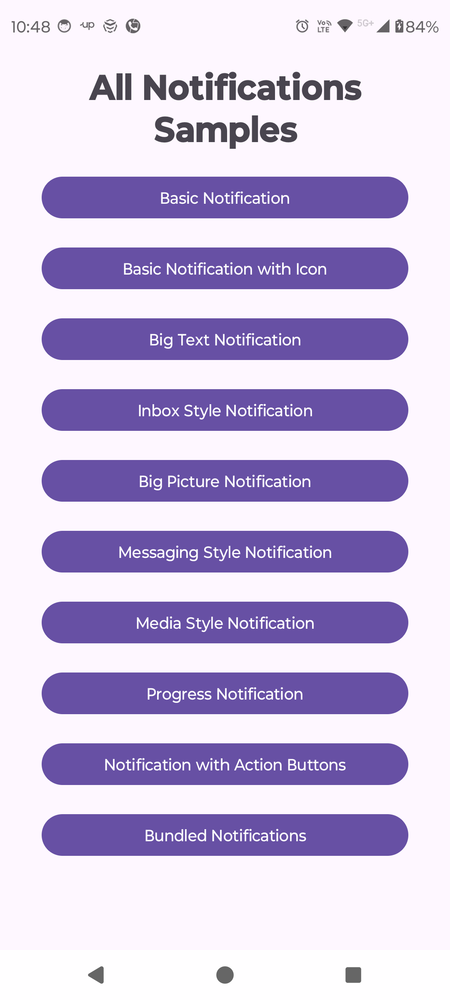

# NotificationExplorer

NotificationExplorer is an Android app showcasing various types of notifications in Android using Kotlin. It provides a hands-on example for developers to understand how to implement and manage different notification styles, with a user-friendly interface displaying all available notification types.

## Features

- **Basic Notification**: Simple notification example.
- **Basic Notification with Icon**: Adds an icon to the basic notification.
- **Big Text Notification**: Showcases a notification with a larger text block.
- **Inbox Style Notification**: Displays a notification with multiple lines, similar to an email inbox.
- **Big Picture Notification**: Includes an image in the notification.
- **Messaging Style Notification**: Supports messaging conversation style in notifications.
- **Media Style Notification**: Demonstrates media controls in a notification.
- **Progress Notification**: Shows an ongoing task with progress.
- **Notification with Action Buttons**: Includes interactive action buttons.
- **Bundled Notifications**: Groups multiple notifications together.

## Tech Stack

- **Kotlin**: Modern language for Android development.
- **Android SDK**: The latest Android APIs for notification handling.

## Screenshots

| Home Screen | Notifications |
|-------------|---------------|
|  | Example notifications for different types |

## Installation

1. Clone the repository:
   ```bash
   git clone https://github.com/sumitray01/NotificationExplorer.git
